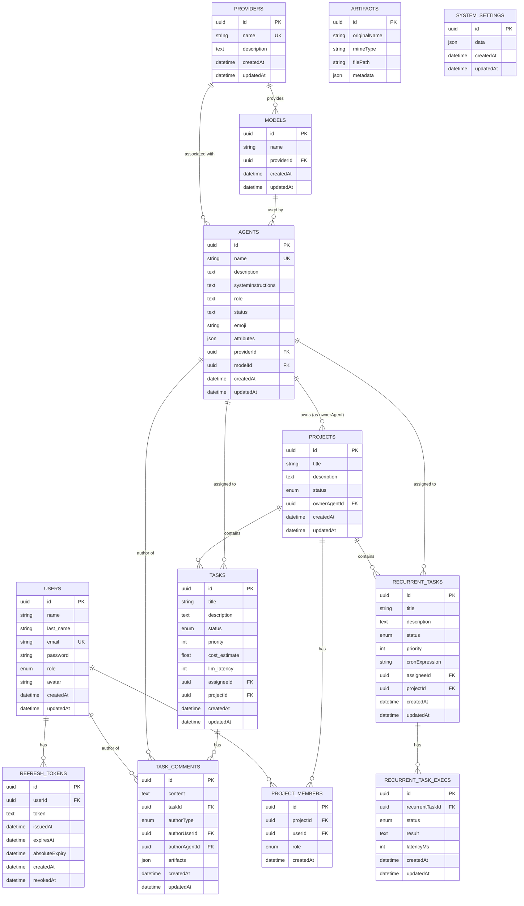

# Database ERD

This document contains the Entity Relationship Diagram (ERD) for the Agent Orchestrator database, generated using Mermaid.js.

```mermaid
erDiagram
    USERS ||--o{ REFRESH_TOKENS : "has"
    USERS ||--o{ PROJECT_MEMBERS : "is member of"
    USERS ||--o{ TASK_COMMENTS : "author of"
    
    PROJECTS ||--o{ PROJECT_MEMBERS : "has"
    PROJECTS ||--o{ TASKS : "contains"
    PROJECTS ||--o{ RECURRENT_TASKS : "contains"
    AGENTS ||--o{ PROJECTS : "owns (as ownerAgent)"
    
    PROVIDERS ||--o{ MODELS : "provides"
    PROVIDERS ||--o{ AGENTS : "associated with"
    MODELS ||--o{ AGENTS : "used by"
    
    AGENTS ||--o{ TASKS : "assigned to"
    AGENTS ||--o{ TASK_COMMENTS : "author of"
    AGENTS ||--o{ RECURRENT_TASKS : "assigned to"
    
    TASKS ||--o{ TASK_COMMENTS : "has"
    
    RECURRENT_TASKS ||--o{ RECURRENT_TASK_EXECS : "has"

    USERS {
        uuid id PK
        string name
        string last_name
        string email UK
        string password
        enum role
        string avatar
        datetime createdAt
        datetime updatedAt
    }

    REFRESH_TOKENS {
        uuid id PK
        uuid userId FK
        text token
        datetime issuedAt
        datetime expiresAt
        datetime absoluteExpiry
        datetime createdAt
        datetime revokedAt
    }

    PROJECTS {
        uuid id PK
        string title
        text description
        enum status
        uuid ownerAgentId FK
        datetime createdAt
        datetime updatedAt
    }

    PROJECT_MEMBERS {
        uuid id PK
        uuid projectId FK
        uuid userId FK
        enum role
        datetime createdAt
    }

    AGENTS {
        uuid id PK
        string name UK
        text description
        text systemInstructions
        text role
        text status
        string emoji
        json attributes
        uuid providerId FK
        uuid modelId FK
        datetime createdAt
        datetime updatedAt
    }

    MODELS {
        uuid id PK
        string name
        uuid providerId FK
        datetime createdAt
        datetime updatedAt
    }

    PROVIDERS {
        uuid id PK
        string name UK
        text description
        datetime createdAt
        datetime updatedAt
    }

    TASKS {
        uuid id PK
        string title
        text description
        enum status
        int priority
        float cost_estimate
        int llm_latency
        uuid assigneeId FK
        uuid projectId FK
        datetime createdAt
        datetime updatedAt
    }

    TASK_COMMENTS {
        uuid id PK
        text content
        uuid taskId FK
        enum authorType
        uuid authorUserId FK
        uuid authorAgentId FK
        json artifacts
        datetime createdAt
        datetime updatedAt
    }

    RECURRENT_TASKS {
        uuid id PK
        string title
        text description
        enum status
        int priority
        string cronExpression
        uuid assigneeId FK
        uuid projectId FK
        datetime createdAt
        datetime updatedAt
    }

    RECURRENT_TASK_EXECS {
        uuid id PK
        uuid recurrentTaskId FK
        enum status
        text result
        int latencyMs
        datetime createdAt
        datetime updatedAt
    }

    ARTIFACTS {
        uuid id PK
        string originalName
        string mimeType
        string filePath
        json metadata
    }

    SYSTEM_SETTINGS {
        uuid id PK
        json data
        datetime createdAt
        datetime updatedAt
    }
```
