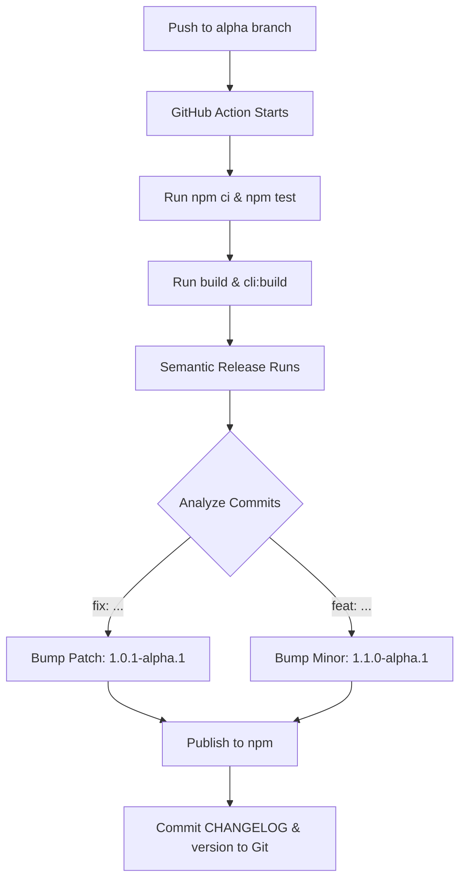

# Agent Orchestrator: Automated Release Pipeline

The release pipeline entails a continuous deployment system that automatically handles versioning, changelog generation, and publishing to the npm registry.

## 1. The Tools
- **GitHub Actions**: The CI/CD engine that runs the build and release jobs on every push.
- **Semantic Release**: The tool that determines the next version number automatically based on structured commit messages.
- **Trusted Publishing (OIDC)**: A secure method for GitHub to authenticate with npm WITHOUT using static secret passwords or tokens.

## 2. The Flow


## 3. Key Configuration Files

### `.releaserc.json` (Release Configuration)
- **`branches`**: 
  - `main`: Triggers stable releases.
  - `alpha`: Triggers pre-releases (e.g., `1.0.0-alpha.1`).
- **`npmPublish: true`**: Instructs the system to push the built package to the npm registry.
- **`plugins`**: A sequence of steps:
  1. `commit-analyzer`: Parses commit messages (e.g., `feat:`, `fix:`).
  2. `release-notes-generator`: Compiles the release notes.
  3. `changelog`: Updates the `CHANGELOG.md` file.
  4. `npm`: Handles the `package.json` version bump and npm publication.
  5. `github`: Creates a GitHub Release and tags the repository.
  6. `git`: Commits the updated `CHANGELOG.md` and `package.json` back to the repository.

### `.github/workflows/release.yml` (Action Definition)
- **`permissions`**: Includes `id-token: write`. This identity token provides the authorization required for Trusted Publishing.
- **Build Steps**: Includes execution of `npm run build` and `npm run cli:build`. This ensures the `dist` folder is populated prior to publish, guaranteeing the resulting NPM package contains the required production artifacts.

## 4. Trusted Publishing (OIDC) Configuration
Instead of storing a static `NPM_TOKEN` in GitHub Secrets, the project utilizes **Trusted Publishing**:
1.  **npm Registry**: npm is configured to "trust" the specific GitHub repository (`bpinhosilva/agent-orchestrator`) and the associated workflow file (`release.yml`).
2.  **GitHub Actions**: When the workflow executes, it requests a temporary identity/OIDC token from GitHub.
3.  **Authentication**: npm verifies the token and authenticates the GitHub Actions workflow, securely permitting the automated package deployment.

## 5. Troubleshooting & Maintenance

### Triggering a new release manually
Since Semantic Release dictates versioning based purely on `feat:` or `fix:` commits, forcing a release without standard code changes requires an explicit empty commit trigger:
```bash
git commit --allow-empty -m "fix: explicit release trigger"
git push origin alpha
```
