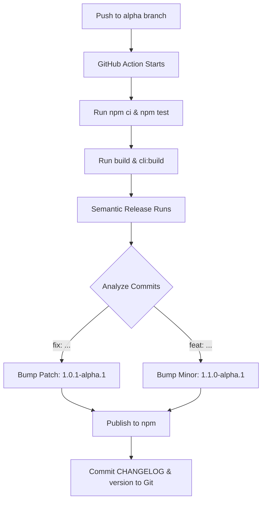

# Agent Orchestrator: Comprehensive CLI & Release Reference

This document provides a deep dive into the architecture of the CLI, the automated release systems, their configurations, and maintenance guidelines.

---

## 1. CLI System (`agent-orchestrator`)

The CLI provides a command-line interface to interact with the orchestrator directly from the terminal. It is built using [Commander.js](https://github.com/tj/commander.js).

### Configuration in `package.json`
- **`name`**: `@bpinhosilva/agent-orchestrator` (The scoped package name).
- **`bin`**: Maps the command name to the entry point.
  ```json
  "bin": {
    "agent-orchestrator": "dist/cli.js"
  }
  ```
- **`cli:build` script**:
  ```bash
  tsc src/cli.ts --outDir dist --esModuleInterop --skipLibCheck --target es2020 --moduleResolution node --module commonjs --experimentalDecorators --emitDecoratorMetadata && chmod +x dist/cli.js
  ```
  *   **What it does**: Compiles the TypeScript CLI file specifically ensuring NestJS decorators are supported and makes the resulting JavaScript file executable (`chmod +x`).

### Code Structure (`src/cli.ts`)
The CLI acts as a "shell" that bootstraps the NestJS `AppModule`:
1.  Defines the `run` command.
2.  In the `action` callback, it calls `NestFactory.create(AppModule)`.
3.  Starts the server (defaulting to port 3000).

### Testing Commands
| Action | Command | Purpose |
| :--- | :--- | :--- |
| **Local Build** | `npm run cli:build` | Compiles the CLI to the `dist` folder. |
| **Local Help** | `node dist/cli.js --help` | Verifies the CLI commands are mapped correctly without installing globally. |
| **Local Run** | `node dist/cli.js run` | Starts the server locally using the CLI entry point. |
| **Global Install** | `npm install -g .` | Installs the current local folder as a global command (useful for testing prior to publishing). |

---

## 2. Automated Release Pipeline

The release pipeline entails a continuous deployment system that automatically handles versioning, changelog generation, and publishing to the npm registry.

### The Tools
- **GitHub Actions**: The CI/CD engine that runs the build and release jobs on every push.
- **Semantic Release**: The tool that determines the next version number automatically based on structured commit messages.
- **Trusted Publishing (OIDC)**: A secure method for GitHub to authenticate with npm WITHOUT using static secret passwords or tokens.

### The Flow


### Key Configuration Files

#### `.releaserc.json` (Release Configuration)
- **`branches`**: 
  - `main`: Triggers stable releases.
  - `alpha`: Triggers pre-releases (e.g., `1.0.0-alpha.1`).
- **`npmPublish: true`**: Instructs the system to push the built package to the npm registry.
- **`plugins`**: A sequence of steps:
  1. `commit-analyzer`: Parses commit messages (e.g., `feat:`, `fix:`).
  2. `release-notes-generator`: Compiles the release notes.
  3. `changelog`: Updates the `CHANGELOG.md` file.
  4. `npm`: Handles the `package.json` version bump and npm publication.
  5. `github`: Creates a GitHub Release and tags the repository.
  6. `git`: Commits the updated `CHANGELOG.md` and `package.json` back to the repository.

#### `.github/workflows/release.yml` (Action Definition)
- **`permissions`**: Includes `id-token: write`. This identity token provides the authorization required for Trusted Publishing.
- **Build Steps**: Includes execution of `npm run build` and `npm run cli:build`. This ensures the `dist` folder is populated prior to publish, guaranteeing the resulting NPM package contains the required production artifacts.

---

## 3. Trusted Publishing (OIDC) Configuration
Instead of storing a static `NPM_TOKEN` in GitHub Secrets, the project utilizes **Trusted Publishing**:
1.  **npm Registry**: npm is configured to "trust" the specific GitHub repository (`bpinhosilva/agent-orchestrator`) and the associated workflow file (`release.yml`).
2.  **GitHub Actions**: When the workflow executes, it requests a temporary identity/OIDC token from GitHub.
3.  **Authentication**: npm verifies the token and authenticates the GitHub Actions workflow, securely permitting the automated package deployment.

---

## 4. Troubleshooting & Maintenance

### "Command not found" after install
If `npm install -g` succeeds but `agent-orchestrator` isn't found in the terminal:
1.  Run `npm config get prefix`.
2.  Ensure that `[prefix]/bin` is explicitly included in the system's `$PATH`.

### Triggering a new release manually
Since Semantic Release dictates versioning based purely on `feat:` or `fix:` commits, forcing a release without standard code changes requires an explicit empty commit trigger:
```bash
git commit --allow-empty -m "fix: explicit release trigger"
git push origin alpha
```

### Resetting the local environment
If the local `dist` folder requires a clean reset during development or testing:
```bash
rm -rf dist
npm run build
npm run cli:build
```
